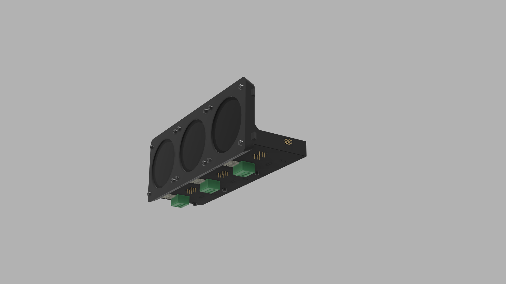
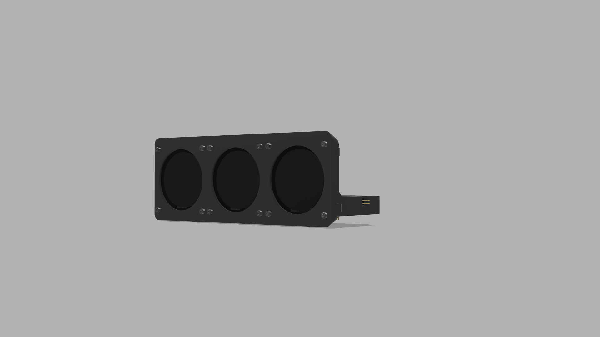
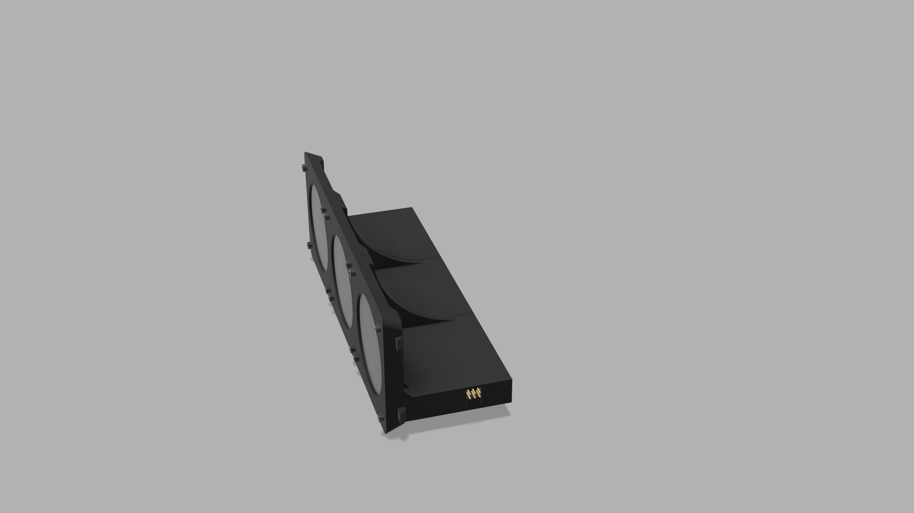

# Marek Sowiński – Portfolio Elektronika

Cześć! Nazywam się **Marek Sowiński** i jestem technikiem elektronikiem z pasją do tworzenia i rozwiązywania problemów. Swoje pierwsze kroki stawiałem w fotografii i reżyserii, ale to właśnie elektronika pochłonęła mnie na dobre. Specjalizuję się w projektowaniu układów elektronicznych, diagnostyce i serwisie modułów, a także automatyzacji procesów technicznych.

---

## 🧰 Umiejętności

- 📐 **Projektowanie PCB** (KiCad, wielowarstwowe układy)
- 🧠 **Programowanie mikrokontrolerów** (C/C++, ESP, AVR)
- 🔍 **Diagnostyka i serwis** elektroniki samochodowej
- 🔧 **Lutowanie THT i SMD** (Hot Air, kolbowa)
- ⚡ **Uprawnienia SEP do 1kV**
- 📊 **Fusion 360, Excel, Word, Adobe**
- 🔄 **Systemy kontroli wersji** – Git
- 📘 **Praca z datasheetami**
- 🧑‍🤝‍🧑 **Zdolności pracy zespołowej**
- 🇬🇧 **Język angielski** – poziom B2

---

## 👨‍💼 Doświadczenie zawodowe

### AutoElektron *(10.2024 – obecnie)*  
**Elektronik**  
- Budowa i rozwój stanowiska do diagnozy sterowników samochodowych  
- Praca diagnostyczno-naprawcza z wykorzystaniem aparatury kontrolno-pomiarowej  
- Serwisowanie modułów elektronicznych pojazdów

### Benning Power Electronics *(09.2024)*  
**Praktykant – konstrukcja szaf sterowniczych**  
- Realizacja projektów dla systemów BMS na podstawie dokumentacji  
- Praca zgodna z normami produkcji przemysłowej

### AutoSp *(07–08.2024)*  
**Konsultant IT**  
- Tworzenie strony internetowej dla serwisu samochodowego  
- Automatyzacja ofert sprzedażowych i systemy inwentaryzacji magazynu

---

## 🎓 Edukacja

- **Technikum nr 1 w Piasecznie** (2020–2025)  
  Dyplom Technika Elektronika ze specjalizacją w mechatronice  
- **Uprawnienia SEP do 1kV** (2023)

---

## 📫 Kontakt

- 📧 [marek.sowinski.praca@gmail.com](mailto:marek.sowinski.praca@gmail.com)  
- 📱 501 028 012  

---

## 📁 Zawartość portfolio

## 🚗 Gejgery – Wyświetlacz parametrów samochodu *(projekt pokazowy)*

**Gejgery** to urządzenie peryferyjne przeznaczone do motoryzacji, stworzone do wyświetlania parametrów pojazdu pobieranych z zewnętrznego sterownika **ECU Master**, w planach rozwoju projektu, przewidywana jest integracja z innym urządzeniem mojej produkcji o nazwie VBC (Vintage Board Computer) oraz odczytywanie danych poprzez złącze diagnostyczne OBD2. Projekt nie jest open source – poniżej prezentuję jedynie zdjęcia urządzenia w celach pokazowych.

### 🖼️ Galeria

#### Obudowa urządzenia:

#### Projekt PCB:

---

📌 *Uwaga: projekt ma charakter demonstracyjny i nie udostępniam jego dokumentacji ani kodu źródłowego.*

---

## 🧠 Komputer Pokładowy VBC *(projekt pokazowy)*

**Komputer Pokładowy VBC** to zaawansowane urządzenie wspomagające kierowcę w monitorowaniu parametrów pracy pojazdu. Powstał z myślą o samochodach starszej generacji, które nie posiadają złącz OBD ani cyfrowych magistrali umożliwiających bezpośredni odczyt danych.

Urządzenie umożliwia:
- Pomiar temperatury cieczy chłodzącej, powietrza, oleju itp.
- Obliczanie spalania chwilowego i średniego
- Monitorowanie przebytego dystansu
- Analizę czasu jazdy, napięcia instalacji, obrotów silnika
- Zbieranie i wyświetlanie danych w czasie rzeczywistym

Projekt jest ciągle rozwijany – wersja 1.0 ma charakter roboczy i skupia się głównie na implementacji w pojeździe **VW Golf II**, który był bazowym modelem testowym.

---

### 🛠️ Dlaczego VBC?

Wiele klasycznych samochodów nie posiada nowoczesnych komputerów pokładowych. Celem VBC jest dostarczenie kierowcy informacji, które normalnie dostępne są jedynie w nowoczesnych pojazdach lub po kosztownej modyfikacji. 

VBC wyróżnia się:
- Integracją z istniejącym licznikiem analogowym
- Minimalną inwazyjnością montażu
- Możliwością działania bez dodatkowych czujników (bazując na sygnałach już obecnych w aucie)
- Modułową budową – łatwą w serwisie i dalszym rozwoju

---

### 🔧 Budowa i montaż

System VBC dzieli się na cztery podstawowe moduły:
- **Komputer główny** – steruje systemem, analizuje dane i komunikuje się z wyświetlaczem
- **Wyświetlacz** – montowany najczęściej w miejscu zegarka cyfrowego na desce rozdzielczej
- **Zegary** – klasyczne wskaźniki współpracujące z systemem
- **Manipulator** – najlepiej wykorzystać oryginalną manetkę MFA, umożliwiającą zmianę trybów i danych

Zalecany sposób montażu:
- Komputer ukryty w miejscu książki serwisowej
- Wiązka sygnałowa połączona z pinami licznika
- Wyświetlacz w miejscu zegarka
- Manetka w oryginalnym uchwycie MFA

💡 *Uwaga: zegary nie muszą posiadać wbudowanego komputera MFA, urządzenie działa z podstawowymi wersjami liczników.*

---

### ⚠️ Kompatybilność i wsparcie

Urządzenie było projektowane pod **VW Golf II**, ale możliwe jest jego zastosowanie w innych samochodach. W takich przypadkach wymagane może być dopasowanie połączeń na podstawie schematów instalacji elektrycznej konkretnego pojazdu.

W razie pytań lub problemów technicznych – zapraszam do kontaktu. Pomagam z instalacją, konfiguracją i diagnostyką.

---

### 🖼️ Wizualizacja PCB

---

📌 *Uwaga: projekt ma charakter pokazowy. Kod źródłowy i pełna dokumentacja nie są publicznie dostępne.*

---

Dzięki za odwiedzenie mojego portfolio i serdecznie zapraszam do kontaktu!
